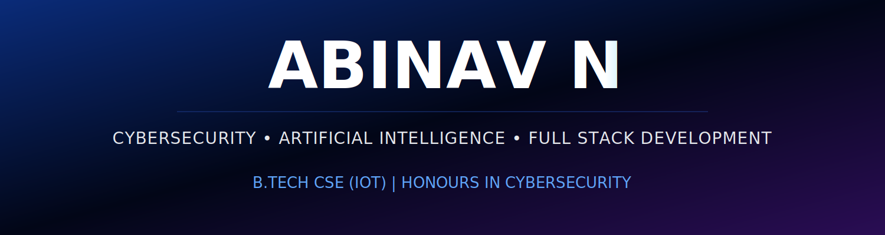

  

<h1 align="center">Abinav N</h1>

<h3 align="center">
B.Tech Computer Science (IoT)  
Honours in Cybersecurity
</h3>

Passionate about Cybersecurity, AI/ML, and Full Stack Development.
I enjoy building intelligent applications, exploring security concepts, and solving real-world problems through technology.

---

##  About Me

🎓 3rd Year B.Tech Computer Science (IoT)

🔐 Honours in Cybersecurity

🤖 Interested in Artificial Intelligence & Machine Learning

🌐 Full Stack Web Developer

🐧 Linux & Security Enthusiast

📚 Continuously learning and building projects

---

## 🛠️ Tech Stack

### Languages

### Frontend

### Backend

### Mobile Development

### Database

### Security & Dev Tools

### Data & Analytics

---

## 📊 GitHub Statistics

---

## 🔥 GitHub Streak

---

## 📈 Contribution Graph

---

## 🐍 Contribution Snake

---

## 📫 Connect With Me

---

⭐ Always interested in collaborating on Cybersecurity, AI/ML, and Full Stack Development projects.

